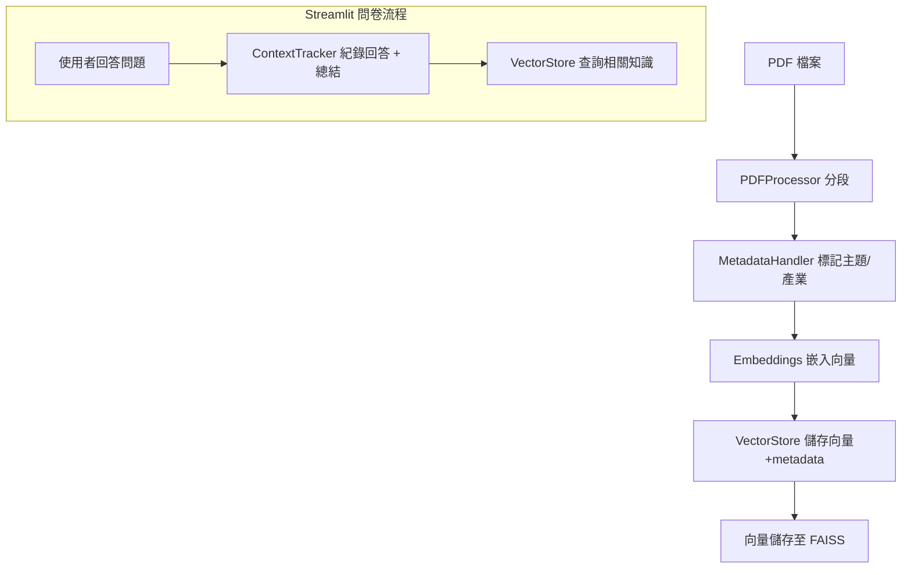

# 🧩 模組索引：ESG GPT 顧問系統

本文件記錄專案所有核心模組、功能角色與彼此關聯，適用於開發維護、交接與擴充。

---

## 🗂️ 目錄架構總覽

```
esg-gpt-bot/
├── app.py
├── build_vector_db.py
├── requirements.txt
│
├── src/
│   ├── consult_chat_app.py
│   ├── welcome.py
│   ├── context_tracker.py
│   ├── question_router.py
│   └── utils/
│       └── vector_guard.py
│
├── vector_builder/
│   ├── pdf_processor.py
│   ├── embeddings.py
│   ├── metadata_handler.py
│   ├── vector_store.py
│
├── data/
│   ├── db_pdf_data/
│   └── vector_output/
```
---
## 📍 Mermaid Canvas（模組對接圖）

flowchart TD
    user --> welcome
    welcome --> consult_chat_app
    consult_chat_app --> question_router --> answer_session
    consult_chat_app --> context_tracker
    context_tracker --> vector_guard --> vector_store
    consult_chat_app --> report_generator

---

## 📍 主介面模組（src/）

| 模組                            | 功能說明                                                                 |
|---------------------------------|--------------------------------------------------------------------------|
| `consult_chat_app.py`           | ESG 顧問對談介面，主要互動流程頁                                        |
| `welcome.py`                    | 使用者進入點，輸入姓名與產業資訊                                        |
| `context_tracker.py`           | 儲存每題使用者回答，並記錄 GPT 總結摘要                                |
| `question_router.py`           | 控制問卷流程，決定下一題邏輯，並將問題轉為自然語言                      |
| `utils/vector_guard.py`        | fallback 工具，確認向量庫存在，避免系統錯誤                            |

---

## 🧠 向量處理模組（vector_builder/）

| 模組                            | 功能說明                                                                 |
|---------------------------------|--------------------------------------------------------------------------|
| `pdf_processor.py`              | 將 PDF 每頁轉為文字，使用 LangChain 分段處理                            |
| `metadata_handler.py`           | 判斷每段落的主題、產業、地區與語言屬性                                 |
| `embeddings.py`                 | 呼叫 OpenAI Embedding API，將段落轉為向量                               |
| `vector_store.py`              | 控制向量儲存、讀取、快取檢查（FAISS）                                   |

---

## 🛠️ 向量建置腳本

| 檔案                         | 功能說明                                          |
|------------------------------|---------------------------------------------------|
| `build_vector_db.py`         | 建置向量庫主腳本，支援快取與略過已處理 PDF       |
| `vector_output/`             | 儲存向量資料庫（faiss_index.index + metadata）   |
| `vector_build_record.json`   | 記錄已處理過的 PDF 路徑，避免重複處理             |

---

## 📁 資料結構說明（data/）

| 資料夾                         | 說明                                             |
|--------------------------------|--------------------------------------------------|
| `data/db_pdf_data/`            | 原始 PDF 知識資料（分國際、台灣、案例）         |
| `data/vector_output/`          | 儲存向量資料庫與處理紀錄                        |

---

## 🧩 模組互動流程（簡圖）



---

## 🔄 模組可擴充性建議

| 功能場景             | 建議模組擴充名稱              | 備註                           |
|----------------------|-------------------------------|--------------------------------|
| 報告生成             | `report_generator_app.py`      | 可依回答自動撰寫摘要建議       |
| 自由問答查詢         | `free_qa.py`                   | 可呼叫向量庫進行知識查詢       |
| RAG 文本補充         | `retriever_engine.py`          | 結合 metadata 做來源引用        |
| 上傳新文件           | `pdf_upload_app.py`            | 供管理者加入新知識             |

---

## ✅ 最後備註

- 本專案已具備完整資料流與模組邊界
- 未來模組開發請維持相同風格：**職責單一、命名清晰、可維護**
- 若有新成員加入，建議先閱讀本檔案與 `README.md`

```
